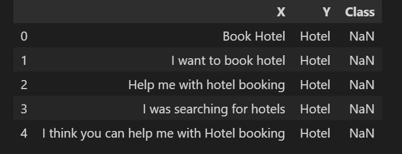
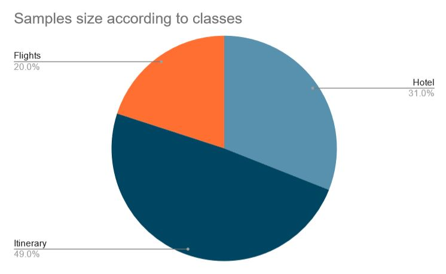

# Travel-Bot
As we all know tour packages are costly, if we travel without any tour agencies, that is plan on our own, it can save lots of money. To save time planning the whole trip, I thought of TB, not Tuberculosis but TravelBot, who can help with you planning your whole trip. 

TravelBot(TB) is something I thought would be for people who like going out there on their own, travel and explore many places. My idea was to build a customised bot which can recommend Itineraries, Hotels and Flights. 

## Technical Stack 
- **Frontend** - ReactJS
- **Backend** - Python (Flask)
- **Database** - MongoDB
- **Model** - LSTM

The ipyn contains model developed using BERT too, since I wanted to learn, as this is my first time developing for NLP task, I have preferred LSTM over BERT. The dataset which have been used is customised, it contains 100 examples for three classes, the current accuracy of the model is 72%. The dataset can be increased if crowdsourced and can predict more classes like price, group and type. The model is developed for Recognising the intent of the user text, currently it predicts three classes Flights, Hotels and Itineraries. 

Here is a example of how the dataset looks:



The composition of classes in it: 



You can checkout the complete dataset in /dataset/f3.csv

## How to run the project
- For installing all the ReactJS dependancies. 
```
npm install
```

- For starting the ReactJS server.
```
npm start
```

- For the server
  - You can create a virtual environment or you can use your local environment. 
  ```
  pip install requirements.txt
  ```
  - If you have created a virtual environment, activate it or else you can directly run the following command:
  ``` 
  python app.py
  ```
  Or 
  ```
  flask run
  ``` 
  Check if the debugger is active or you can go with the first command. 

Here are the screenshots of the app:

.png)  

.png)  

.png)

.png)     

.png)

.png)
